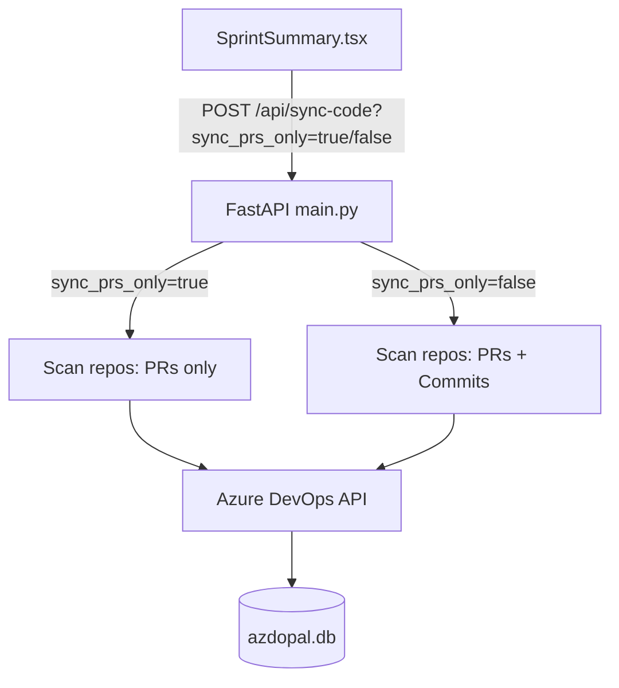
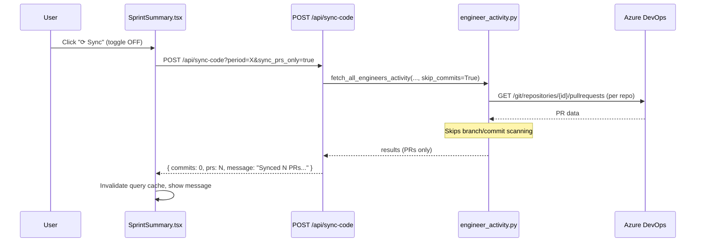
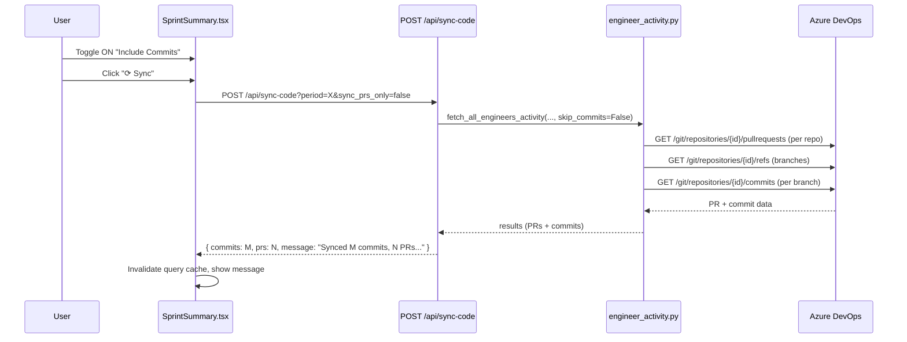

# Design Document: Sync Toggle PRs & Commits

## Overview

The Sprint Summary (Code) page currently has a single "Sync" button that fetches both commits and PRs from Azure DevOps in one operation. This feature separates the sync behavior so that by default only PRs are synced (which is faster and more commonly needed), while commits can be optionally included via a toggle. This gives users control over sync scope and reduces unnecessary API calls to ADO when only PR data is needed.

The change spans the full stack: the FastAPI backend gains a `sync_prs_only` query parameter on the existing `/api/sync-code` endpoint, and the React frontend adds a toggle control next to the sync button that controls whether commits are included.

## Architecture



## Sequence Diagrams

### Default Sync (PRs Only)



### Sync with Commits Included



## Components and Interfaces

### Component 1: Backend API (`/api/sync-code`)

**Purpose**: Orchestrates the sync operation, now with an option to skip commit fetching.

**Interface Change**:
```python
@app.post("/api/sync-code")
def sync_code(
    period: str,
    team: Optional[str] = None,
    sync_prs_only: bool = True,  # NEW: defaults to True (PRs only)
):
    ...
```

**Responsibilities**:
- Accept the new `sync_prs_only` query parameter (default: `True`)
- Pass `skip_commits` flag to `fetch_all_engineers_activity`
- Return appropriate message reflecting what was synced

### Component 2: Engineer Activity Module (`engineer_activity.py`)

**Purpose**: Scans ADO repos for PRs and commits. Gains ability to skip commit scanning.

**Interface Change**:
```python
def fetch_all_engineers_activity(
    client: ADOClient,
    emails: list[str] | None,
    from_dt: datetime,
    to_dt: datetime,
    refresh_repos: bool = False,
    repos_override: list[dict] | None = None,
    conn: sqlite3.Connection | None = None,
    skip_commits: bool = False,  # NEW parameter
) -> dict[str, dict]:
    ...

def _scan_repo(
    client: ADOClient,
    repo: dict,
    emails: set[str] | None,
    from_str: str,
    to_str: str,
    prs_by_eng: dict,
    commits_by_eng: dict,
    conn: sqlite3.Connection | None,
    period: str,
    from_date: str,
    to_date: str,
    skip_commits: bool = False,  # NEW parameter
):
    ...
```

**Responsibilities**:
- When `skip_commits=True`, skip the branch listing and commit scanning loop entirely
- Still scan all PRs regardless of the flag
- Still flush PR data to DB when `skip_commits=True`

### Component 3: Frontend Toggle (`SprintSummary.tsx`)

**Purpose**: Provides UI control for the user to opt-in to commit syncing.

**Interface**:
```typescript
// New state in SprintSummary component
const [includeCommits, setIncludeCommits] = useState(false);

// Modified sync call
const handleSync = async () => {
  const syncPrsOnly = !includeCommits;
  const res = await post<{ message: string }>(
    "/api/sync-code",
    { period, team, sync_prs_only: String(syncPrsOnly) }
  );
  ...
};
```

**Responsibilities**:
- Maintain toggle state (default: OFF = PRs only)
- Pass `sync_prs_only` parameter to the API
- Display toggle inline with the sync button

## Data Models

No new database tables or columns are needed. The existing `commits` and `pull_requests` tables remain unchanged. The feature only controls which data gets fetched and stored during a sync operation.

### API Request Parameters

```typescript
// POST /api/sync-code query params
interface SyncCodeParams {
  period: string;        // Sprint period identifier
  team?: string;         // Optional team filter
  sync_prs_only?: string; // "true" (default) or "false"
}
```

### API Response (unchanged)

```typescript
interface SyncCodeResponse {
  engineers: number;
  commits: number;   // Will be 0 when sync_prs_only=true
  prs: number;
  message: string;
}
```

## Key Functions with Formal Specifications

### Function 1: `sync_code` (backend endpoint)

```python
@app.post("/api/sync-code")
def sync_code(period: str, team: Optional[str] = None, sync_prs_only: bool = True):
    ...
```

**Preconditions:**
- `period` is a non-empty string matching an existing sprint name in the DB
- `sync_prs_only` is a boolean (defaults to `True` if not provided)
- ADO client credentials are configured in environment

**Postconditions:**
- If `sync_prs_only=True`: only PR records are upserted in the DB; no new commit records are created
- If `sync_prs_only=False`: both PR and commit records are upserted (original behavior)
- Response `commits` field is 0 when `sync_prs_only=True`
- Response `message` reflects what was actually synced

### Function 2: `_scan_repo` (with skip_commits)

```python
def _scan_repo(client, repo, emails, from_str, to_str,
               prs_by_eng, commits_by_eng, conn, period,
               from_date, to_date, skip_commits=False):
    ...
```

**Preconditions:**
- `repo` dict contains valid `id` and `name` keys
- `from_str` and `to_str` are valid ISO datetime strings
- `skip_commits` is a boolean

**Postconditions:**
- PRs are always fetched and stored regardless of `skip_commits`
- When `skip_commits=True`: no branch listing API calls are made, no commit API calls are made, `commits_by_eng` is not modified for this repo
- When `skip_commits=False`: original behavior (branches listed, commits fetched per branch)
- Returns `(pr_count, commit_count, branch_count)` where `commit_count=0` and `branch_count=0` when `skip_commits=True`

### Function 3: `handleSync` (frontend)

```typescript
const handleSync = async (): Promise<void> => {
  ...
}
```

**Preconditions:**
- `period` is set (non-empty string)
- `includeCommits` state reflects current toggle position

**Postconditions:**
- API is called with `sync_prs_only` = `!includeCommits`
- On success: query cache is invalidated, success message displayed
- On error: error message displayed
- `syncing` state is properly reset in all cases (finally block)

## Algorithmic Pseudocode

### Modified `_scan_repo` Flow

```pascal
ALGORITHM _scan_repo(client, repo, emails, from_str, to_str, ..., skip_commits)
INPUT: repo dict, date range, skip_commits flag
OUTPUT: (pr_count, commit_count, branch_count)

BEGIN
  repo_id ← repo["id"]
  repo_name ← repo["name"]

  // --- Always scan PRs ---
  FOR EACH status IN ("active", "completed", "abandoned") DO
    prs ← client.get_paginated(repo_id, status, from_str, to_str)
    FOR EACH pr IN prs DO
      process_pr(pr, prs_by_eng, repo_prs)
    END FOR
  END FOR

  // --- Conditionally scan commits ---
  IF skip_commits = false THEN
    branches ← client.get(repo_id, refs)
    FOR EACH branch IN branches DO
      commits ← client.get_paginated(repo_id, branch, from_str, to_str)
      FOR EACH commit IN commits DO
        process_commit(commit, commits_by_eng, repo_commits)
      END FOR
    END FOR
  ELSE
    branches ← []
  END IF

  // --- Flush to DB ---
  flush_repo_to_db(conn, period, repo_name, repo_prs, repo_commits, ...)

  RETURN (count(repo_prs), count(repo_commits), count(branches))
END
```

## Example Usage

### Backend

```python
# PRs only (default behavior after change)
POST /api/sync-code?period=Sprint%2042&team=MyTeam
# → {"engineers": 5, "commits": 0, "prs": 23, "message": "Synced 23 PRs from 5 engineers for MyTeam."}

# Full sync (commits + PRs)
POST /api/sync-code?period=Sprint%2042&team=MyTeam&sync_prs_only=false
# → {"engineers": 5, "commits": 87, "prs": 23, "message": "Synced 87 commits, 23 PRs from 5 engineers for MyTeam."}
```

### Frontend

```tsx
// Toggle + Sync button in the header
<label className="sync-toggle">
  <input
    type="checkbox"
    checked={includeCommits}
    onChange={(e) => setIncludeCommits(e.target.checked)}
  />
  Include Commits
</label>
<button className="sync-btn" onClick={handleSync} disabled={syncing || !period}>
  {syncing ? "Syncing…" : "⟳ Sync"}
</button>
```

## Correctness Properties

1. **PR-always property**: For any value of `sync_prs_only`, PRs are always fetched and stored. `∀ sync_prs_only ∈ {true, false}: prs_fetched = true`

2. **Commit-gating property**: Commits are fetched if and only if `sync_prs_only=false`. `commits_fetched ⟺ ¬sync_prs_only`

3. **Default-safety property**: When `sync_prs_only` is not provided, it defaults to `True`, meaning no commits are fetched. `missing(sync_prs_only) ⟹ commits_fetched = false`

4. **Toggle-state property**: The frontend `includeCommits` state is the logical inverse of `sync_prs_only` sent to the API. `sync_prs_only = ¬includeCommits`

5. **Response-consistency property**: The `commits` count in the response is 0 when `sync_prs_only=true`. `sync_prs_only = true ⟹ response.commits = 0`

6. **No-regression property**: When `sync_prs_only=false`, behavior is identical to the current (pre-change) behavior. `sync_prs_only = false ⟹ behavior = original_behavior`

## Error Handling

### Error Scenario 1: ADO API Failure During PR Fetch

**Condition**: ADO returns an error for a specific repo's PR query
**Response**: Skip that repo (existing behavior via try/except in `_scan_repo`), continue with remaining repos
**Recovery**: User can retry sync; already-scanned repos are skipped via `mark_repo_scanned`

### Error Scenario 2: Invalid `sync_prs_only` Parameter

**Condition**: Client sends a non-boolean value for `sync_prs_only`
**Response**: FastAPI's query parameter parsing handles this — invalid values result in 422 Unprocessable Entity
**Recovery**: Frontend always sends valid "true"/"false" strings

### Error Scenario 3: Network Timeout During Long Sync

**Condition**: Full sync (with commits) takes too long
**Response**: Existing timeout handling in ADOClient; partial data is committed per-repo
**Recovery**: Re-running sync skips already-scanned repos. Toggle to PRs-only for faster sync.

## Testing Strategy

### Unit Testing Approach

- Test `_scan_repo` with `skip_commits=True` to verify no commit API calls are made (mock ADOClient)
- Test `_scan_repo` with `skip_commits=False` to verify commits are still fetched (regression)
- Test `sync_code` endpoint with both parameter values
- Test default parameter behavior (no `sync_prs_only` param → defaults to True)

### Integration Testing Approach

- End-to-end test: call `/api/sync-code?sync_prs_only=true` and verify DB has new PR records but no new commit records
- End-to-end test: call `/api/sync-code?sync_prs_only=false` and verify both PRs and commits are stored
- Frontend: verify toggle state correctly maps to API parameter

### Property-Based Testing Approach

**Property Test Library**: hypothesis (Python)

- Property: For any valid period and team combination, calling sync with `sync_prs_only=True` never produces commit records for that sync run
- Property: The response `commits` field equals the sum of commits across all engineers when `sync_prs_only=False`

## Performance Considerations

- **PRs-only sync is significantly faster**: Commit scanning requires listing all branches per repo and then fetching commits per branch. For a project with 50+ repos and many branches, this can take minutes. PR scanning only requires 3 API calls per repo (one per status).
- **Default to PRs-only**: Since most users primarily care about PR metrics, defaulting to PRs-only improves the typical sync experience.
- **No additional API calls**: The toggle adds no overhead — it only removes calls when enabled.

## Security Considerations

- No new authentication or authorization changes needed
- The `sync_prs_only` parameter is a simple boolean with no injection risk
- Existing ADO token-based auth continues to apply

## Dependencies

- No new dependencies required
- Existing: FastAPI, React, @tanstack/react-query, Azure DevOps REST API
